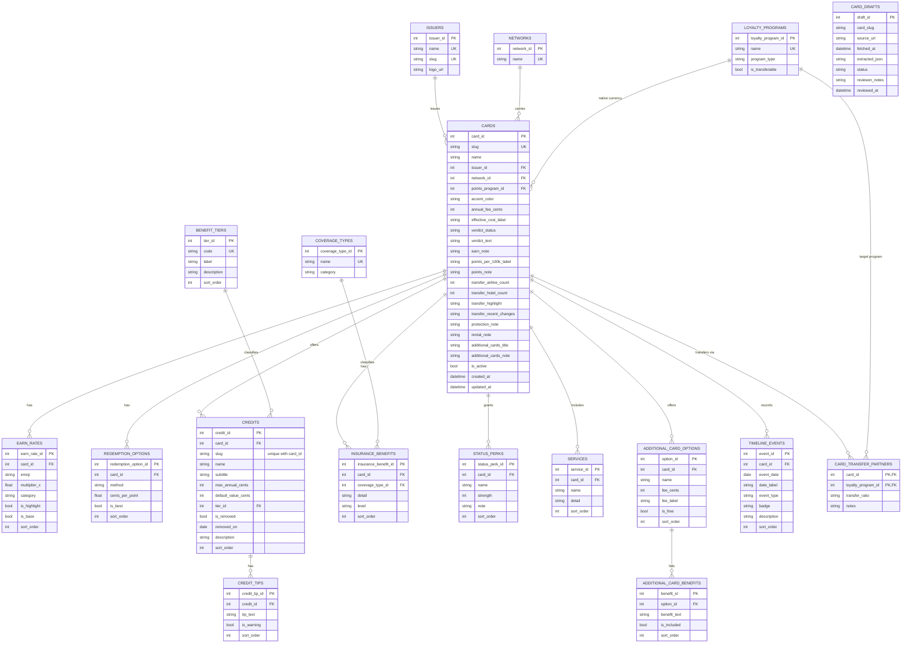

# Backend — card catalog database

The card catalog is a normalized relational schema (17 tables), not a single JSON
blob. This doc covers the schema shape, how data actually gets in, and how to add
or update a card.

## Why a database instead of one JSON file

`backend/data/cards.json` (a single ~750-line array) worked for four hand-written
cards, but doesn't scale: repeated strings with no integrity (issuer/network names
can drift between cards), no way to query across cards ("which cards have primary
rental coverage?"), one malformed brace breaks every card at once, and no path to
letting the catalog grow without a PR per edit.

## Schema

- **Reference/lookup tables** — `issuers`, `networks`, `loyalty_programs`,
  `benefit_tiers`, `coverage_types`. Shared across cards, get-or-created by name so
  "American Express" resolves to the same row for every card that uses it.
- **`cards`** — the core entity. One row per card.
- **Detail tables** — one per repeating block in the original data: `earn_rates`,
  `redemption_options`, `credits` (+ `credit_tips`), `insurance_benefits`,
  `status_perks`, `services`, `additional_card_options` (+ `_benefits`),
  `timeline_events`. Each has a `sort_order` column standing in for array position,
  and cascades on delete with its card.
- **`card_transfer_partners`** — junction table (card ↔ named transfer partner).
  Schema is ready but currently unpopulated for most cards — the source data only
  has aggregate counts (`transfer_airline_count`/`transfer_hotel_count` on `cards`),
  not an authoritative per-partner list with ratios. Populate this once a reliable
  per-partner source exists, rather than inventing entries.
- **`card_drafts`** — the review queue. Not part of the normalized schema itself;
  holds fetched-and-extracted card data pending human approval before it's promoted
  into the tables above.



`card_drafts` has no FK to `cards` on purpose — it's a staging area, not part of the
normalized graph above (see "How data gets in" below).

Design choices worth knowing before touching this schema:
- **Money is integer cents** (`annual_fee_cents`, not a float `annual_fee`) — no
  rounding drift. The API layer converts to whole dollars at the response boundary.
- **`is_removed`, not deleted.** A discontinued credit (e.g. Amex Platinum's old
  Saks credit) stays a row with `is_removed = true` — historical accuracy is a
  product feature (see the card detail page's timeline), not just data hygiene.
- **Every FK is indexed.** Postgres doesn't do this automatically, and it's easy to
  forget when adding a new detail table.

## How data gets in

```
backend/data/cards/staging/{slug}.json  →  drafts add  →  card_drafts (pending)
                                                          │
                                                    drafts promote
                                                          │
                                                          ▼
                                              upsert_card() [backend/scripts/upsert.py]
                                                          │
                                                          ▼
                                            normalized tables (cards, credits, ...)
                                                          │
                                                          ▼
                                move file: staging/{slug}.json → {issuer}/{slug}.json
```

`upsert_card()` is the single write path — both draft promotion and any future
direct re-sync go through it. It's idempotent: re-running it for an already-live
card updates the row and fully replaces its child collections (credits, earn
rates, etc.) rather than duplicating them.

## Adding or updating a card

1. Research the card from its official issuer page. Prefer the issuer's own site
   over third-party aggregators for factual claims (fees, credit amounts, terms) —
   editorial content like tips and the keep/reconsider verdict is necessarily a
   judgment call either way.
2. Write the card to `backend/data/cards/staging/{slug}.json`, matching the
   `Card` shape in `backend/models.py`. A file in `staging/` means "drafted,
   not yet promoted" — the seeding fixture in `tests/backend/conftest.py`
   skips this folder for exactly that reason, so a pending card never behaves
   like a live one in tests. See `backend/data/cards/staging/README.md`.
   For co-branded cards (a bank card tied to an airline/hotel loyalty program),
   the `id` follows `{issuer}-{brand}-{type}`, e.g. `amex-hilton-honors-aspire`
   or `amex-marriott-bonvoy-brilliant` — keeps cards from the same loyalty
   program grouped together alphabetically and makes the issuer unambiguous.
3. Add it to the review queue:
   ```bash
   uv run python -m backend.scripts.drafts add <slug> "<source url>" backend/data/cards/staging/<slug>.json
   ```
   This validates against the Pydantic schema before it's even allowed into the
   queue — a draft that doesn't parse never becomes something to review.
4. Review it: `uv run python -m backend.scripts.drafts show <draft_id>`
5. Promote it (or reject it with a reason):
   ```bash
   uv run python -m backend.scripts.drafts promote <draft_id> --notes "..."
   uv run python -m backend.scripts.drafts reject <draft_id> --notes "..."
   ```
   A rejected draft can't be promoted later — fix the JSON and add it as a new
   draft instead.
6. Once promoted, move the file out of staging into its issuer folder so the
   file tree matches what's actually live:
   ```bash
   git mv backend/data/cards/staging/<slug>.json backend/data/cards/<issuer>/<slug>.json
   ```

## Migrations

```bash
# after changing backend/db_models.py
uv run alembic revision --autogenerate -m "description"
uv run alembic upgrade head
```

Autogenerated migrations for SQLite sometimes need a manual `server_default` added
for new `NOT NULL` columns (SQLite can't `ALTER TABLE ADD COLUMN NOT NULL` without
one to backfill existing rows) — check the generated file before applying.

## Known gaps

- `card_transfer_partners` is unpopulated for most cards (see Schema above).
- No bulk "seed everything" script yet — a fresh database needs each card added
  and promoted individually (see Getting Started in the top-level README).
- User accounts / persisted calculator state (which credits a specific person
  actually uses) isn't built — the frontend calculator is currently client-side
  state only, reset on page refresh.
